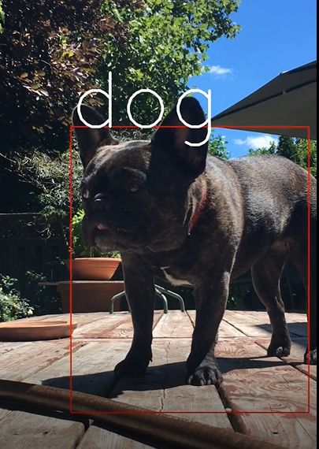

By using **Deep Learning** and more specifically, **SSD** (Single Shot Multibox Detection), you can easily program your computer to identify objects like dogs, cats, people, etc. This project is in Part 2 of the *Computer Vision A-Z* Course.

## Program Mechanics
In actuality, my program is used to add visual-graphics to videos, like in the above image of Lucy. It's a 4 step-process:

1. read the input video: taking each individual frame
2. for each frame:
  -get TL & BR coordinates of detected object(s)
  -draw a box around the detection(s) & label it
3. String the edited frames together into an output video

## Next Steps
As a photo-/videography hobbyist, I'd like to add such graphics into my creations. I think it'd add a "techie" vibe.
To integrate this into my workflow, 3 things need to happen:

- [ ] add original video's audio to the output video
- [ ] let users select destination of output-video in file-system  
- [ ] let users choose where in their video to apply graphics, not just the whole thing
